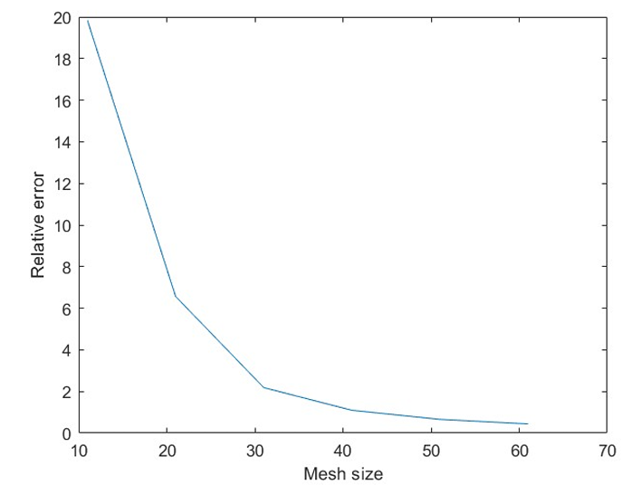
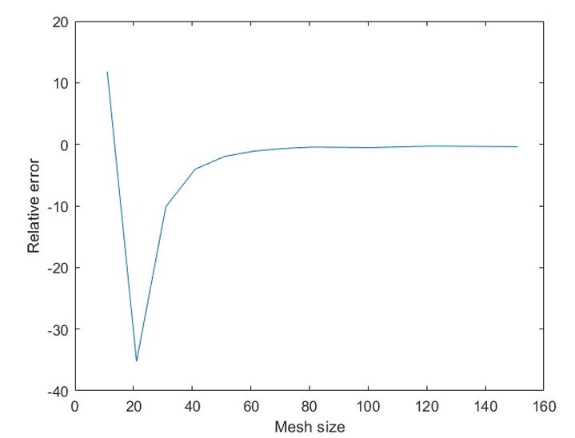
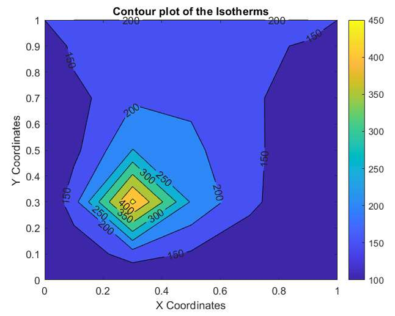

# Project Overview
This project implements finite volume–based 1D and 2D steady‑state heat conduction solvers in MATLAB, including internal heat generation, grid‑independence tests, and TDMA for tridiagonal systems. The codebase is organized into separate scripts for 1D slab conduction, 2D plate conduction, and variations with single and multiple internal heat sources.

This project is hosted at [https://github.com/SatvikS3638/ConductionFVM].

# Problem Setup
## 1D Slab with Heat Generation
* Geometry: Solid slab with length L = 0.5, cross‑sectional area A=0.01 m², thermal conductivity k=1000 W/m‑K.
* Boundary conditions: T(0)=100 ∘C and T(L)=500 ∘C, extended to include a uniform volumetric heat generation term q.
* Discretization: Domain divided into 5 control volumes, with coefficient matrix and temperature vector formulated symbolically in terms of q.

## 2D Plate with Local Heat Sources
* Geometry: Square plate, L=B=1 m, discretized into a structured 5×5 grid of internal control volumes.
* Boundary conditions: Left, right, and bottom edges at 100 ∘C; top edge at 200 ∘C.
* Source cases:
  - Case 1: Single heat source at the plate center (0.5, 0.5) m.
  - Case 2: Two equal sources at (0.25, 0.5) m and (0.75, 0.5) m, distributed to neighboring nodes using distance‑based weighting.

# Numerical Methodology
## Finite Volume Discretization
* 1D and 2D steady heat conduction with source, and its 2D analogue with S=q.
* Control‑volume integration yields algebraic equations of the form aPTP = aWTW + aETE + aNTN + aSTS + SU, with coefficients assembled into matrix M and source vector S.

## Symbolic Formulation and TDMA
* For 1D problem, the coefficient matrix and source vector were defined symbolically in terms of q to obtain general expressions for nodal temperatures; a numeric solution was then obtained by substituting a chosen q (e.g., q=1000 W/m³).
* A TDMA implementation was written for the 1D problem with a zero‑flux boundary at the right side, modifying the last node coefficients appropriately before forward elimination and back substitution.

## Source Treatment in 2D
* Single source: Source term SU directly modified at the node coinciding with the center location (e.g., node (4,4) for 5×5 grid), with SU =q.
* Two sources: Source contributions split between adjacent nodes based on distance weights, e.g., 0.25/0.75 fractions added to SU of neighboring nodes around (0.25, 0.5) and (0.75, 0.5).

# Grid Independence and Validation
## 1D Grid Independence
* Mesh sizes: n=5,11,21,31,41,51,61 nodes were tested, monitoring the temperature at the mid‑domain location x=0.25 m.
* Metric: Relative percentage error with respect to the previous mesh; convergence criterion set to < 1%, achieved for mesh sizes above 41 nodes.

## Analytical Comparison (1D)
* Analytical solution with uniform source q was derived and evaluated at multiple points using the equation for T(x) in terms of Ta, Tb ad q.
* Numerical temperatures from the FVM solver showed close agreement with the analytical curve for refined meshes, confirming correctness of the discretization and implementation.

## 2D Grid Independence
* For both single and double source cases, grid sizes were increased (e.g., up to 51×51 and 81×81) and temperatures at the plate center (0.5, 0.5) were monitored.
* Relative error stabilised below 1% for meshes of 51×51 (single source) and 81×81 (two sources), indicating grid‑independent solutions.
Given below are the plots of relative error against mesh size for the cases with one and two heat sources respectively. 

# Results and Visualizations
## 1D Temperature Profiles
* For q=1000 W/m³, the 1D temperature profile deviates from linear and exhibits a curved distribution as expected for internal heat generation.
* Symbolic formulation produced temperature expressions as functions of q; plots for different q values form families of non‑parallel lines, illustrating sensitivity to heat generation.

## 2D Temperature Fields
* With a single central source, the temperature field shows a clear peak in the interior, smoothly decaying towards the isothermal boundaries.
* With two off‑center sources, the solution exhibits two hot spots around the source locations; the coefficient tables and source terms reflect the redistributed source strengths (e.g., Su entries of 750 and 250 W for weighted nodes). Given below are the temperature distribution contours for the cases with one and two heat sources, respectively.

1[Temperature distributionn for two heat sources](assets/images/2st.png)
​

​

​

